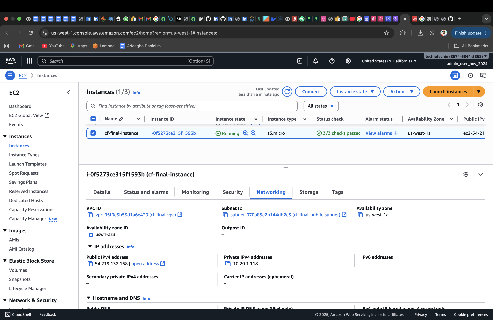

# 3 Stages Code Pipeline Application build Project

MINI PROJECT
- This project demonstrates how to build and deploy a simple web application using a **three-stage CI/CD pipeline** with **AWS CloudFormation** as the deployment provider.  

Project Objectives
- Build a **3-stage CI/CD pipeline** to automate deployment of an application.
- Use **CloudFormation** as the deploy provider in the pipeline.
- Source application code directly from **GitHub**.
- Ensure the application runs inside a **custom VPC**.
- Validate templates with **cfn-lint** during the build stage.

The pipeline is divided into three stages.
1. Source Stage 
   Fetches the source code from GitHub.

2. Build Stage 
   Runs a CodeBuild project that:  
   Installs Python 3.9  
   Install Cfn-lint 
   Create the zip (artifact) for the deploy stage 

3. Deploy Stage
   Uses AWS CloudFormation to launch infrastructure and application.

---

Pipeline Overview 
[]

---

Build Stage Logs 
[]

[]

[]

[]

[]

---

CloudFormation Stack Outputs 
[]

---

EC2 Instance Details 
[]

---

Web Browser Output
[]
